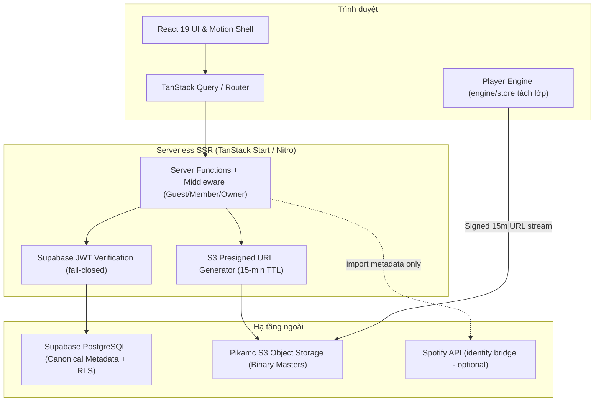

<div align="center">

# 🦆 Duckroom — Personal Music Platform

<p align="center">
  <b>Kho nhạc & MV cá nhân giữ nguyên binary master · lyrics-first · lossless-first playback</b>
</p>

[](https://duckroom.vercel.app)
[](https://react.dev)
[](https://www.typescriptlang.org)
[](https://aws.amazon.com/s3/)
[](https://supabase.com)
[](https://tailwindcss.com)
[](https://vercel.com)

[🌐 Web App](https://duckroom.vercel.app) &nbsp;•&nbsp; [📖 Master Plan](docs/DUCKROOM_MASTER_PLAN.md) &nbsp;•&nbsp; [⚡ Audit hiện tại](docs/audit/CURRENT_VERIFICATION.md)

---

</div>

## 🌟 Tổng quan

**Duckroom** là nền tảng web phát và quản lý media cá nhân với nguyên tắc cốt lõi: **giữ nguyên binary master** đã tải lên — không tự transcode, không tự mutate. Metadata kỹ thuật (codec, sample rate, bit depth, duration, SHA-256) được đo trực tiếp từ file thật bởi phân tích server-side; nếu không xác định được thì hiển thị **Unknown**, không bịa giá trị.

Kiến trúc: **PostgreSQL (Supabase)** là canonical metadata source-of-truth duy nhất, **Pikamc S3** là binary store, ứng dụng chạy trên **React 19 + TanStack Start (SSR)**.

> ⚠️ Về chất lượng âm thanh/video: Duckroom phát đúng file gốc qua signed URL và không nén lại. Tuy nhiên playback diễn ra trong browser — Duckroom **không tuyên bố** "bit-perfect", "0ms latency" hay "100% gapless", vì các trình duyệt không bảo đảm được điều đó. Chất lượng thực tế phụ thuộc file nguồn và khả năng decode của browser.

## 🔥 Tính năng

### 🔊 Player & Âm thanh

- **Master preservation**: giữ nguyên FLAC/WAV/ALAC/M4A như đã upload.
- **Short-lived presigned URLs**: mọi playback đi qua link ký số 15 phút do server cấp; không lưu URL tĩnh.
- **Crossfade 0–10s**, gapless best-effort theo giới hạn browser.
- **ReplayGain Off/Track/Album** — giá trị dB đọc từ tag thật của file (server analysis), chỉ áp dụng ở playback, không đụng vào master.
- **Player engine tách rời UI**: audio engine độc lập với render pressure của React; multi-tab arbitration qua BroadcastChannel; continue-listening restore cho Member.

### 🎬 Video archive

- Lưu trữ MP4/MKV/WebM/MOV bản gốc; phát qua HTML5 video + HTTP Range.
- Khả năng phát phụ thuộc container/codec mà browser hỗ trợ.

### 🎤 Lyrics-first

- Synced (.lrc) + plain lyrics; offset hiển thị ±ms không đụng timestamp gốc.
- Nguồn đa provider có ghi nhận `source`: embedded, LRCLIB, Lyrics.ovh, nhập tay, import.
- Timeline editor (tap-sync theo waveform) trong Review Center lúc upload.

### 🔒 Phân quyền 3 tầng — Guest / Member / Owner

| Khả năng                                             | Guest | Member | Owner |
| ---------------------------------------------------- | :---: | :----: | :---: |
| Nghe public library, lyrics, artwork                 |  ✅   |   ✅   |  ✅   |
| Share link                                           |  ✅   |   ✅   |  ✅   |
| Favorites / Playlists / History / Continue listening |  ❌   |   ✅   |  ✅   |
| Upload master / sửa metadata / trash                 |  ❌   |   ❌   |  ✅   |
| Storage tools / user management / audit logs         |  ❌   |   ❌   |  ✅   |

- Auth fail-closed: JWT verify phía server (`supabase.auth.getUser`), role đọc từ DB, không tin payload client.
- Service-role key chỉ tồn tại server-side; secret scan gate chạy trong CI.

### 📦 Ingestion pipeline

- Phân tích binary thật: magic-byte dispatch, Xing/VBRI, ISOBMFF moov-tail fallback.
- SHA-256 transport integrity — client/server mismatch fail-closed.
- Duplicate detection (exact/likely/uncertain) + quyết định upload_anyway/use_existing/cancel.
- Review Center: bulk edit, retry, recovery states có cleanup-debt compensation.

### 🔗 Share & Spotify bridge

- Share link dạng `/s/{token}` — token 128-bit chỉ lưu SHA-256 hash, thu hồi được, hết hạn tùy chọn, OG preview cho social.
- Spotify chỉ là **identity/metadata bridge**: paste URL → lấy metadata → khớp local file kèm confidence → Owner xác nhận → lưu vào `external_identities`. Không có Spotify vẫn nghe bình thường.

---

## 🛠️ Tech Stack

| Tầng             | Công nghệ                      | Vai trò                             |
| :--------------- | :----------------------------- | :---------------------------------- |
| Frontend         | React 19 + TypeScript 5.8      | UI + Concurrent Rendering           |
| Routing & SSR    | TanStack Start + Router        | Full-stack SSR, type-safe routing   |
| Server Engine    | Nitro (preset Vercel)          | Serverless build output             |
| Media Storage    | Pikamc S3 + @aws-sdk/client-s3 | Binary masters + presigned URLs     |
| Canonical DB     | Supabase PostgreSQL + RLS      | Metadata định danh, phân quyền      |
| Styling & Motion | Tailwind CSS v4 + Motion       | Design system, reduced-motion aware |
| Testing          | Vitest 4 + ESLint 9 + Prettier | 270+ test, secret-scan gate         |

---

## 🏗️ Kiến trúc & Luồng dữ liệu



---

## ⚡ Chạy cục bộ

### 1. Yêu cầu

- Node.js 20+ / npm 10+

### 2. Cài đặt

```bash
npm ci
```

### 3. Cấu hình môi trường

```bash
cp .env.example .env
```

Điền đầy đủ theo `.env.example`. Các nhóm khóa:

- Supabase: `VITE_SUPABASE_URL`, `VITE_SUPABASE_ANON_KEY`, `SUPABASE_SERVICE_ROLE_KEY`
- S3: `S3_ENDPOINT`, `S3_REGION`, `S3_BUCKET_NAME`, `S3_ACCESS_KEY_ID`, `S3_SECRET_ACCESS_KEY`
- Owner bootstrap: `DUCKROOM_OWNER_EMAIL`
- Tùy chọn: `DUCKROOM_PUBLIC_ORIGIN`, `SPOTIFY_CLIENT_ID`, `SPOTIFY_CLIENT_SECRET`

Thiếu bất kỳ khóa server bắt buộc nào → app fail-closed ngay khi khởi động (đây là hành vi chủ ý).

### 4. Migrations

Toàn bộ schema nằm trong `supabase/migrations/` (append-only). Áp dụng theo thứ tự tên file lên một Postgres/Supabase project trước khi chạy app với dữ liệu thật.

### 5. Kiểm tra & chạy

```bash
npx tsc --noEmit     # typecheck
npm run lint         # eslint
npm test             # vitest suite
npm run build        # production build (Vite + Nitro/Vercel)
npm run scan:secrets # secret gate trên bundle client
npm run dev          # dev server
```

## 📈 Trạng thái kỹ thuật

Bốn mức xác minh cần phân biệt rõ — README này chỉ claim hai mức đầu:

| Mức                     | Phạm vi                                                                                           | Trạng thái                                                    |
| ----------------------- | ------------------------------------------------------------------------------------------------- | ------------------------------------------------------------- |
| **Implemented**         | Master Plan Phase 0–11 theo §30                                                                   | ✅ Toàn bộ phase ladder đã có code trong repo                 |
| **Tested in-repo**      | 290+ test case (mocked transports) + typecheck/lint/build/secret-scan + dev-server smoke          | ✅ Green trên working copy                                    |
| **Externally verified** | Live Supabase (migrations + RLS/security matrix), live S3, credential rotation, browser perf pass | ⛔ Chưa — đây là external gates bắt buộc trước public release |
| **Release-ready**       | Cả 3 mức trên đồng thời                                                                           | ❌ NO                                                         |

Migration filenames dùng convention đánh số thứ tự dạng ngày (`20260819…20260904`) chạy trước lịch thực — nó thể hiện THỨ TỰ áp dụng, không phải ngày áp dụng thật.

Chi tiết verdict từng phase: `docs/audit/FINAL_PHASE_8_11_AUDIT.md`, `docs/audit/FINAL_PHASE_0_7_AUDIT.md`, `docs/AGENT_HANDOFF.md`.
