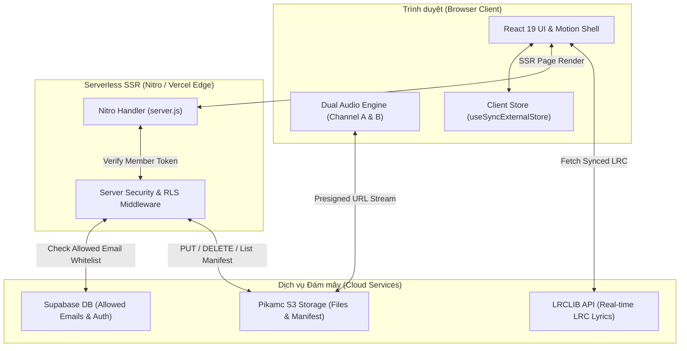

<div align="center">

# 🦆 Duckroom — Ultimate Hi-Res Lossless Audio & 4K Video Vault

<p align="center">
  <b>Hệ thống lưu trữ & phát nhạc FLAC 24-bit, WAV Studio Master & Video MV 4K cá nhân không nén</b>
</p>

[](https://duckroom.vercel.app)
[](https://react.dev)
[](https://www.typescriptlang.org)
[](https://aws.amazon.com/s3/)
[](https://supabase.com)
[](https://tailwindcss.com)
[](https://vercel.com)

[🌐 Truy cập Web App Live](https://duckroom.vercel.app) &nbsp;•&nbsp; [📖 Tài liệu Kiến trúc](#-kiến-trúc-hệ-thống--luồng-dữ-liệu) &nbsp;•&nbsp; [⚡ Hướng dẫn Chạy Cục bộ](#-hướng-dẫn-cài-đặt--chạy-cục-bộ)

---

</div>

## 🌟 Tổng quan dự án (Overview)

**Duckroom** là ứng dụng Web phát nhạc và video cá nhân chuẩn **Hi-Res Lossless Audio (24-bit / 96kHz – 192kHz)** và **Video MV 4K Master**. Được thiết kế cho những người dùng khắt khe về chất lượng âm thanh nguyên bản, Duckroom loại bỏ hoàn toàn các bước transcode/nén giảm dung lượng thường thấy trên các nền tảng thương mại.

Ứng dụng kết hợp sức mạnh của **React 19**, **TanStack Start (SSR)**, bộ nhớ đám mây **Pikamc S3 Object Storage**, và hệ thống xác thực **Supabase Auth + Database RLS**.

---

## 🔥 Tính năng nổi bật (Key Features)

### 🔊 1. Trải nghiệm Âm thanh Hi-Res Không Nén (Pure Lossless)
- **Zero Compression**: Phát trực tiếp bản thu FLAC 24-bit, ALAC, WAV nguyên bản từ S3 Bucket mà không nén lại bit-depth hay sample-rate.
- **7-Day Presigned Audio Streaming**: Tự động cấp URL chữ ký số (Presigned URL) 7 ngày đảm bảo bảo mật và tốc độ phát tức thì.

### 🎚️ 2. Động cơ Hòa âm Chuyển bài Kép (Dual-Engine Gapless Crossfade)
- **Dual-Audio Engine**: Sử dụng 2 kênh audio ẩn song song (`Audio Channel A` & `Audio Channel B`).
- **Nạp trước thông minh**: Tự động pre-load bài hát tiếp theo vào kênh đệm 10 giây trước khi kết thúc bài hiện tại.
- **Crossfade tùy chỉnh**: Tùy chỉnh hòa âm 5s – 10s mượt mà 0ms độ trễ hoặc tắt khi nghe Album/Concert liền mạch.

### 🎬 3. Phát Video MV 4K Master & Artwork Trực quan
- **Phát MV 4K Bitrate Cao**: Phát video H.264/H.265 bitrate gốc với bộ trình chiếu video tùy chỉnh 60 FPS.
- **Trình Cắt & Căn chỉnh Artwork**: Tích hợp công cụ cắt ảnh Artwork chuyên nghiệp (`ArtworkCropModal`) tự động phát hiện và loại bỏ viền đen letterbox.

### 🎤 4. Lời Bài Hát (.LRC) Đồng bộ Thời gian thực
- **Real-time Synced Lyrics**: Tự động cuộn lời bài hát chính xác từng giây theo tiến trình nhạc.
- **LRCLIB Auto-Fetch**: Tự động tìm kiếm và nạp lời bài hát đồng bộ từ cơ sở dữ liệu nhạc trực tuyến chỉ với 1 cú nhấp.

### 🔒 5. Bảo mật Triple-Lock & Phân quyền Thành viên
- **Guest Read-Only Mode**: Khách chưa đăng nhập chỉ được nghe nhạc và xem thông tin, không thể sửa/xóa/quét S3 hay tải lên.
- **Allowed Emails Whitelist**: Chỉ những Email nằm trong bảng `allowed_emails` trên Supabase RLS mới có quyền truy cập tính năng Quản trị.
- **Server-side Security Middleware**: Mọi API tải lên S3 hoặc ghi đè Manifest đều được bảo vệ bởi Token JWT phía Server.

### 🎨 6. Giao diện & Hiệu ứng Chuyển động Đỉnh cao (Motion Design)
- **Sliding Active Tab Indicator**: Thanh highlight menu Sidebar tự động trượt theo tab (`layoutId="sidebar-active-pill"`).
- **Background Blur Crossfade**: Nền mờ nghệ thuật chuyển màu mượt 700ms, loại bỏ hoàn toàn hiện tượng nháy màu.
- **Live Audio Spectrum Visualizer**: Trình diễn sóng âm thanh dạng dải tần sống động khi nhạc đang phát.

---

## 🛠️ Công nghệ sử dụng (Tech Stack)

| Tầng (Layer) | Công nghệ / Thư viện sử dụng | Vai trò trong hệ thống |
| :--- | :--- | :--- |
| **Frontend Framework** | **React 19** + **TypeScript 5.7** | Core UI library với Concurrent Rendering & Hooks |
| **Routing & SSR** | **TanStack Start** + **TanStack Router** | Full-stack SSR Framework, Type-safe Routing |
| **Server Engine** | **Nitro Engine** (Preset: Vercel) | Serverless Build & Bundle Output Generator |
| **Media Storage** | **Pikamc S3 Storage** + **@aws-sdk/client-s3** | Lưu trữ tệp âm thanh FLAC/WAV, MV 4K & Artwork |
| **Authentication** | **Supabase Auth** + **Database RLS** | Đăng nhập Email/Password & Phân quyền Whitelist |
| **Styling & Motion** | **Tailwind CSS v4** + **Framer Motion** | Design System, Responsive Layout & Micro-animations |
| **Icons & Utilities** | **Lucide React** + **clsx** / **tailwind-merge** | Bộ icon Vector sắc nét & Helper gộp class CSS |

---

## 🏗️ Kiến trúc Hệ thống & Luồng Dữ liệu (System Architecture)



---

## ⚡ Hướng dẫn Cài đặt & Chạy cục bộ (Getting Started)

### Yêu cầu hệ thống (Prerequisites)
- **Node.js**: `v20.0.0` trở lên
- **Package Manager**: `npm` (v10+) hoặc `pnpm` / `yarn`

### 1. Clone Repository & Cài đặt Thư viện

```bash
git clone https://github.com/TheValkyri/Duckroom.git
cd Vaultlossless
npm install
```

### 2. Cấu hình Biến môi trường (`.env`)

Tạo file `.env` tại thư mục gốc dự án và điền các thông tin cấu hình:

```env
# Supabase Authentication & RLS
VITE_SUPABASE_URL=https://your-project.supabase.co
VITE_SUPABASE_ANON_KEY=your-supabase-anon-key

# Pikamc S3 Storage Configuration
S3_ENDPOINT=https://s3.pikamc.vn
S3_REGION=vn-hcm-1
S3_BUCKET_NAME=pikamc-osi-ccccda39-9eac-43c3-ae21-894787c65678
S3_ACCESS_KEY_ID=your-s3-access-key-id
S3_SECRET_ACCESS_KEY=your-s3-secret-access-key
```

### 3. Khởi chạy Server Phát triển (Development)

```bash
npm run dev
```

Mở trình duyệt tại địa chỉ: `http://localhost:5173`

### 4. Build Production (Serverless Nitro SSR)

```bash
npm run build
```

Lệnh này sẽ biên dịch bản Build Production vào thư mục `.vercel/output` sẵn sàng deploy lên Vercel Edge Serverless.

---

## ⌨️ Phím tắt Hệ thống (Keyboard Shortcuts)

Duckroom tích hợp sẵn hệ thống phím tắt tiện lợi khi nghe nhạc:

| Phím tắt | Thao tác |
| :--- | :--- |
| <kbd>Space</kbd> | Phát / Tạm dừng phát nhạc (Play / Pause) |
| <kbd>Shift</kbd> + <kbd>→</kbd> | Chuyển sang bài tiếp theo (Next Track) |
| <kbd>Shift</kbd> + <kbd>←</kbd> | Quay lại bài trước đó (Previous Track) |
| <kbd>S</kbd> | Bật / Tắt chế độ Trộn bài (Toggle Shuffle) |
| <kbd>R</kbd> | Chuyển chế độ Lặp bài (Repeat Off ➔ All ➔ One) |
| <kbd>L</kbd> | Mở / Đóng giao diện Lời bài hát (Lyrics Panel) |
| <kbd>Esc</kbd> | Tắt giao diện Lời bài hát hoặc Toàn màn hình |

---

## 📁 Cấu trúc Thư mục Dự án (Project Structure)

```text
Vaultlossless/
├── src/
│   ├── components/       # Các UI Component tái sử dụng (TrackRow, AlbumCard, Visualizer...)
│   │   └── player/       # Bộ phát nhạc (PlayerBar, Controls, NowPlaying, QueuePanel...)
│   ├── data/             # Thư viện dữ liệu & Động cơ đồng bộ S3 (library.ts)
│   ├── lib/              # Các Helper core (auth, player, s3, supabase, useLibrary...)
│   ├── routes/           # Các trang Route TanStack Start (index, library, albums, videos, upload, login)
│   ├── router.tsx        # Cấu hình TanStack Router Tree
│   ├── server.ts         # Server Entry Point
│   └── start.ts          # Cấu hình TanStack Start Middleware
├── nitro.config.ts       # Cấu hình Nitro Server Engine Preset Vercel
├── vite.config.ts        # Cấu hình Vite Build & Plugins
├── package.json          # Danh sách Dependencies & Scripts
└── README.md             # Tài liệu Hướng dẫn Dự án
```

---

## 📜 Giấy phép & Bản quyền (License)

Dự án thuộc bản quyền cá nhân của **TheValkyri**. Mọi mã nguồn được bảo lưu bản quyền.

<div align="center">
  <sub>Built with ❤️ for pure audiophiles by <a href="https://github.com/TheValkyri">TheValkyri</a></sub>
</div>
